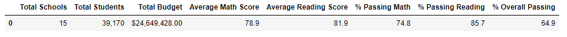
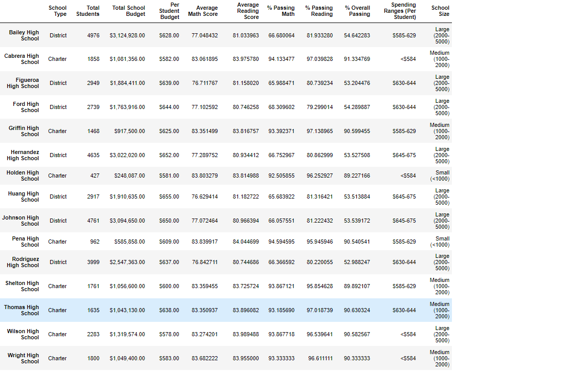
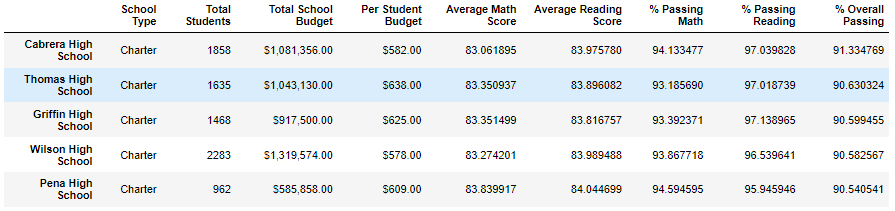
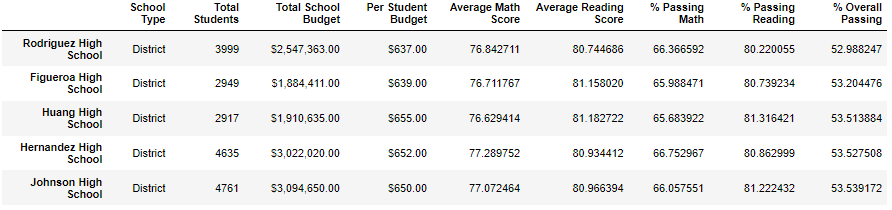
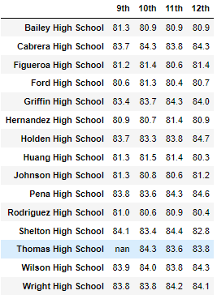
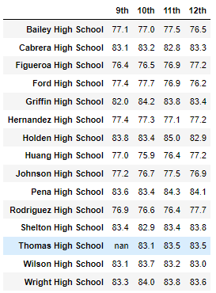
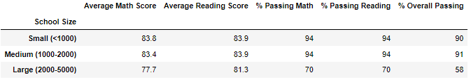
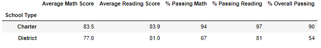
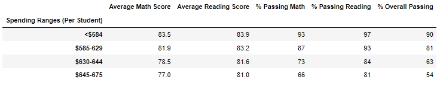

# School District Analysis

## Purpose
The purpose of this project was to analyze data of a school district by cleaning it and organizing it to show several metrics of each school in the district based off of their student's testing scores. After the initial analysis, information was brought to the district showing that there was a possibility that there could have been academic dishonesty from one of the school's 9th grade class. So a second analysis was performed with the potentially dishonest math and reading scores for the 9th graders being replaced with 'NaN' at Thomas High School. 

## Resources
Data source: students_complete.csv & schools_complete.csv

Software: Python 3, Jupyter Notebook, Pandas, Numpy

## Results
### School District Summary 

How was the district summary affected?

- After setting the 9th grade Thomas High School student scores to NaN, the 461 student's scores were not included in the calulations. Because of this:

  - The district average math score decresed by .2 points, while the district average reading score was not changed.

  - The district passing math percentage decreased by .2 percentage points and the district passing reading percentage was decreased by .3 percentage points. 

  - The overall district passing percentage decreased by .1 percentage points. 

### School Summary 
 * need to update photo *
- In this portion of the analysis, the information is separated by school. So the only row affected by the change was Thomas High School. The changes include:

  - Thomas High School's average math score was unaffected, while the average reading score actually increased by .1 points.
  - Thomas High School's average math passing percentage decreased by .1 percentage points and average passing reading percentage decreased by .3 percentage points. 
  - Thomas High School's overall passing percentage decreased by .3 percentage points. 

### Top Schools
- When the 9th grade students scores were removed, their schools overall ranking dropped drastically, but once their scores were calculated for only the 10th - 12th grade students, they regained their position as the second best school in the district. Shown Below:

### Bottom Schools

### Average Scores by School and Grade Level

#### Average Reading Scores

#### Average Math Schores

i
