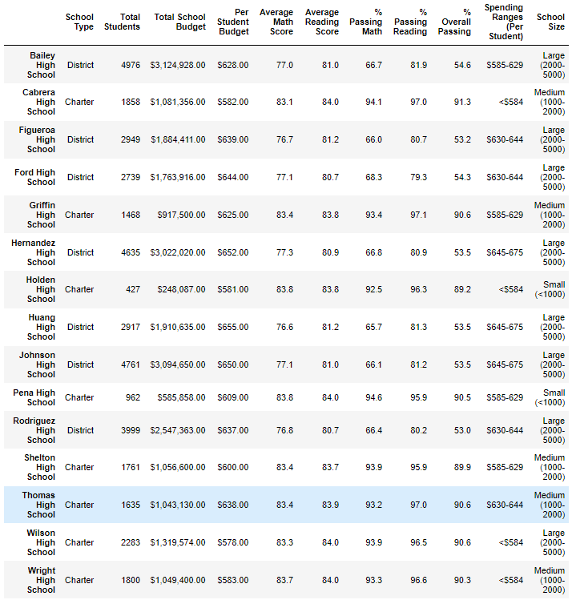

# School District Analysis

## Purpose
The purpose of this project was to analyze data of a school district by cleaning it and organizing it to show several metrics of each school in the district based off of their student's testing scores. After the initial analysis, information was brought to the district showing that there was a possibility that there could have been academic dishonesty from one of the school's 9th grade class. So a second analysis was performed with the potentially dishonest math and reading scores for the 9th graders being replaced with 'NaN' at Thomas High School. 

## Resources
Data source: students_complete.csv & schools_complete.csv

Software: Python 3, Jupyter Notebook, Pandas, Numpy

## Results
### School District Summary 

### School Summary 

### 
